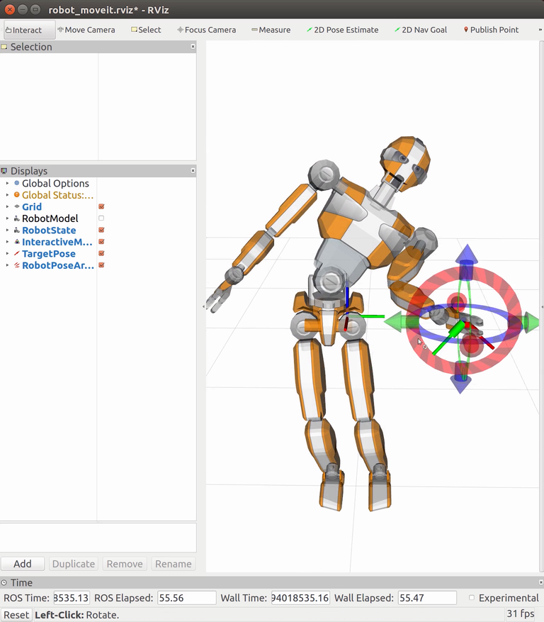

# tvm_samples
Samples of [TVM](https://github.com/jrl-umi3218/tvm)

## Install

ROS is necessary.
```
$ mkdir -p ~/ros/ws_tvm/src
$ cd ~/ros/ws_tvm
$ wstool init src
$ wstool set -t src tmp_sources https://github.com/mmurooka/tmp_sources.git --git -y
$ wstool set -t src mc_rtc_data https://github.com/jrl-umi3218/mc_rtc_data --git -y
$ wstool update -t src

$ source /opt/ros/kinetic/setup.bash # or setup.bash in the other catkin workspace to be cascaded
$ catkin build -DCMAKE_BUILD_TYPE=Release

```

Add the following line to ~/.bashrc.
```
source ~/ros/ws_tvm/devel/setup.bash
```

## Samples

### Interactive IK
```
$ roslaunch tvm_samples tvm_ik_sample_jvrc1.launch
```


